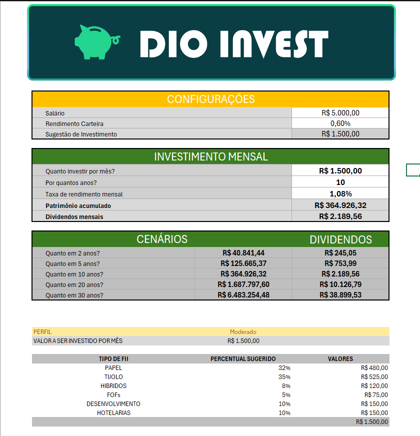

# Investment Simulator

A strategic financial tool designed to help investors project their journey toward financial independence, with a core focus on **Brazilian Real Estate Investment Funds (FIIs)** and compound interest.

> **Note:** This project was developed as a practical exercise for the **"Excel with Artificial Intelligence"** course provided by [DIO](https://www.dio.me/).

---

## Overview

This simulator allows users to visualize how their monthly contributions, combined with dividend reinvestment, can grow over time. It was built to apply advanced spreadsheet techniques and AI-driven logic to bridge the gap between current savings and future passive income goals.

---

## Key Features

- **Smart Contribution Calculation**: Automatically suggests investment amounts based on your current salary and savings capacity.
- **Multi-Decade Projections**: Visualize wealth accumulation and passive income across different time horizons: 2, 5, 10, 20, and 30 years.
- **Custom Risk Profiles**: Built-in logic to suggest asset allocation for Conservative, Moderate, and Aggressive investors.
- **Sector Diversification**: Guided portfolio structure divided into:
  - **Paper** (Receivables / CRIs & CRAs)
  - **Brick** (Logistics, Malls, Corporate Offices)
  - **Hybrids & FOFs** (Fund of Funds)
  - **Agro** (Fiagro)

---

## Preview

> *Replace this placeholder with a real screenshot of your spreadsheet to showcase your work.*

---

## How to Use

1. **Download**: Clone this repository or download the `.xlsx` file directly.
2. **Open**: Navigate to the **Settings** or **Input** tab in the spreadsheet.
3. **Data Entry:**
   - Input your **Current Salary**.
   - Define your **Monthly Contribution** amount.
   - Set the **Expected Portfolio Yield** (e.g., `0.8%` or `1%` per month).
4. **Analysis**: Check the scenario tables to see when you will reach your **"Magic Number"** — the point where dividends cover your monthly expenses.
5. **Rebalancing**: Use the **Profiles** tab to adjust your asset classes based on your risk tolerance.

---

## Technologies & Education

| Technology | Application |
|---|---|
| **Microsoft Excel** | Advanced formulas and data modeling |
| **AI Integration** | Applied logic from DIO course for optimized simulations |
| **Financial Math** | Compound interest and perpetuity formulas |

---

## Disclaimer

This spreadsheet is a **simulation tool only** and does **NOT** constitute financial advice or a recommendation to buy or sell specific assets. Investing in the stock market involves risks. Past performance is not indicative of future results. Always conduct your own research or consult with a certified financial advisor.

---

## License

This project is available for **personal use and study**. Feel free to fork and adapt it to your needs.
